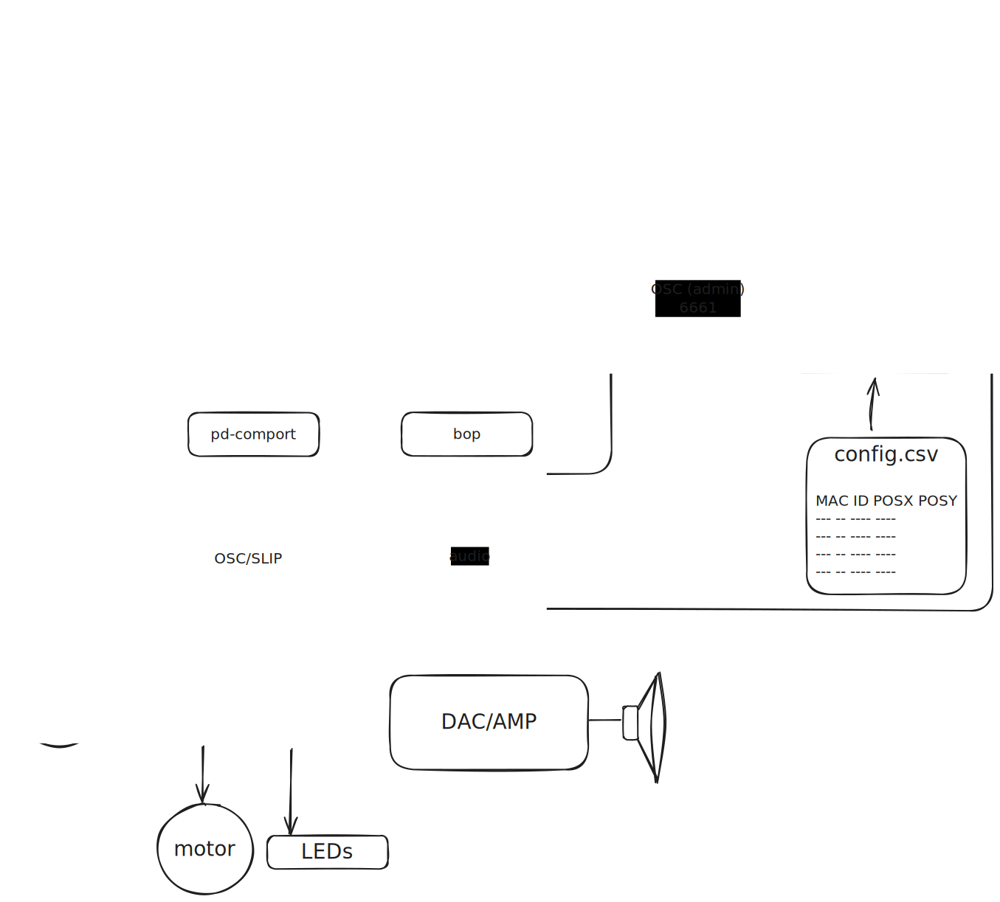

# enormousFM
## The Enormous Radio Project

A Raspberry Pi and Arduino based framework for networked multichannel sound, light, and motion.  




## puredata 0.54 vanilla 

Runs logic, audio duties, OSC.  Communicates to arduino via python helper.
Leverages the [bop](https://github.com/zealtv/bop) library. 

### Requires
- pd-comport
- pd-slip


## python3

Provides admin services (updating, rebooting, shutdown). 


## Arduino

Reads distance sensor and controls lights and stepper motor.  Communicates with PD via SLIP encoded OSC over USB serial.

### Requires:
- https://github.com/thomasfredericks/MicroOsc
- https://github.com/qub1750ul/Arduino_SharpIR
- http://www.airspayce.com/mikem/arduino/AccelStepper/
- https://github.com/FastLED/FastLED


# Installation and Setup
## Flash SD using Raspberry Pi Imager
- Choose OS RASPBERRY PI OS LITE (64-BIT)
- Set username and password
- configure wireless LAN
- enable SSH
- Flash SD

## Install packages
```
# login
ssh pi@raspberrypi.local

# update
sudo apt-get update
sudo apt-get upgrade

# set gpu memory to 16 (if applicable)
sudo raspi-config

# install jack2
sudo apt-get install jackd2

# install git
sudo apt-get install git

# install pure-data dependencies
sudo apt-get install build-essential automake autoconf libtool gettext libasound2-dev libjack-jackd2-dev tcl tk wish

# install puredata 0.54+
cd ~
git clone https://github.com/pure-data/pure-data.git
cd ./pure-data/
./autogen.sh
./configure --enable-jack
make
sudo make install

# install pd externals
sudo apt-get install pd-slip pd-comport

# add externals to local extra folder
mkdir ~/pd-externals
cd ~/pd-externals 
sudo cp /lib/pd/extra/* ./
sudo chown -R pi ./*

```

## Install project code
```
# goto home directory
cd ~

# clone this repo
git clone https://github.com/zealtv/enormousFM.git

# goto scripts directory
cd ./enormousFM/scripts

# run update script to install rc.local autostart file and reboot
sudo ./update.sh

# pi should reboot with jack, python, and puredata running

```

# OSC schema
## from arduino
/knob f
f: knob value 0. to 1.
Potentiometer on pin A0


/distance f
f: distance in millimeters
Analog distance sensor on pin A1


## to arduino
/led i
i: mode

/needle f
f: needle position 0.0 to 1.0